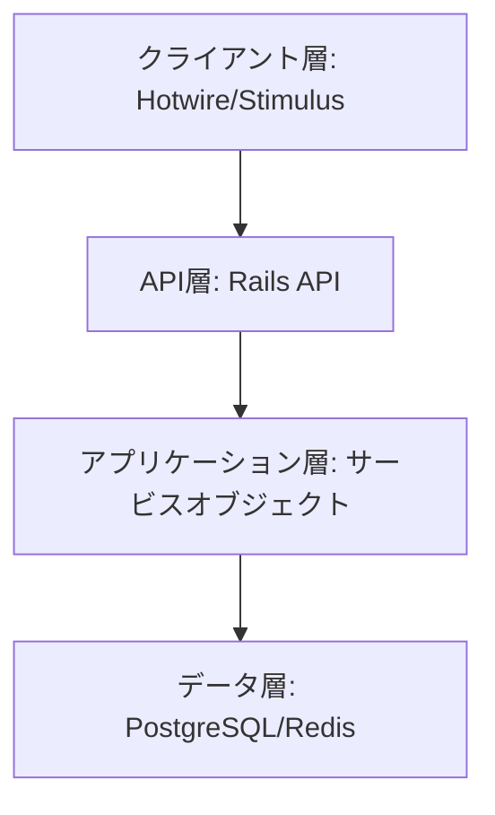
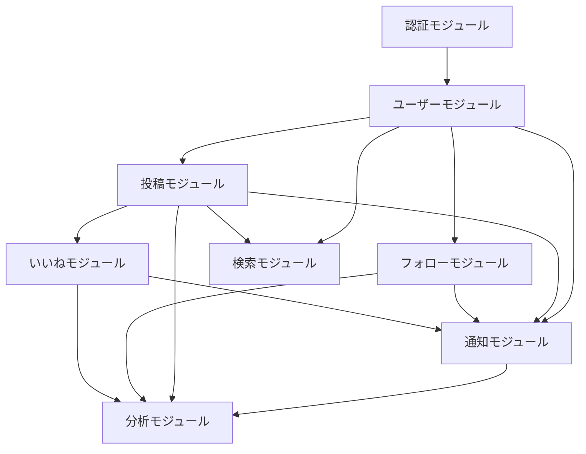

# SNSアプリケーション 実装計画書

## 1. 概要

このドキュメントでは、SNSアプリケーションの実装計画の詳細を定義します。本計画は5つのマイルストーンに基づいて進められ、各マイルストーンには明確なタスク、スケジュール、リソース配分が含まれています。

## 2. 高レベルアーキテクチャ

本アプリケーションは以下の階層構造で構築されます：



### 2.1 主要コンポーネント

| コンポーネント | 説明 | 責任 |
|--------------|------|------|
| ユーザー認証 | パスワードレス認証システム | ユーザーの認証と認可 |
| 投稿管理 | 投稿のCRUD機能 | 投稿の作成、表示、更新、削除 |
| フォロー関係 | ユーザー間の関係管理 | フォロー/フォロワー関係の管理 |
| いいね/コメント | インタラクション管理 | 投稿へのリアクション管理 |
| 通知システム | リアルタイム通知 | ユーザーへの通知配信 |
| 検索エンジン | コンテンツ検索 | ユーザーや投稿の検索 |
| 分析システム | ユーザー行動分析 | 使用状況とパフォーマンスの追跡 |

## 3. モジュール設計とテスト戦略

各コンポーネントは独立してテスト可能なモジュールとして設計されます。

### 3.1 モジュール構造

```
app/
├── models/             # データモデル
├── controllers/        # コントローラー
├── views/              # ビューテンプレート
├── services/           # サービスオブジェクト
│   ├── authentication/ # 認証関連サービス
│   ├── posts/          # 投稿関連サービス
│   ├── follows/        # フォロー関連サービス
│   └── notifications/  # 通知関連サービス
├── repositories/       # リポジトリパターン実装
├── presenters/         # プレゼンターオブジェクト
└── jobs/               # バックグラウンドジョブ
```

### 3.2 テスト戦略

- **単体テスト**: 各クラスの機能を独立してテスト
- **統合テスト**: コンポーネント間の連携をテスト
- **システムテスト**: ユーザーフローをE2Eでテスト
- **パフォーマンステスト**: 重要な機能のベンチマーク

#### テスト構造

```
spec/
├── models/
├── controllers/
├── services/
├── repositories/
├── system/
├── requests/
└── performance/
```

## 4. マイルストーン詳細計画

### 4.1 マイルストーン1: 基盤構築 (2024-04-30 ~ 2024-05-01)

#### 詳細タスク

| タスクID | タスク名 | 説明 | 所要時間(h) | 担当 | 依存関係 |
|---------|---------|------|------------|------|---------|
| ENV-001-1 | Dockerファイル作成 | Ruby, PostgreSQL, Redisの設定 | 2 | 開発者 | なし |
| ENV-001-2 | docker-composeファイル作成 | サービス構成の定義 | 1 | 開発者 | ENV-001-1 |
| ENV-001-3 | VSCode設定ファイル作成 | 拡張機能と設定の定義 | 1 | 開発者 | なし |
| ENV-001-4 | git-flow設定 | ブランチ戦略の実装 | 1 | 開発者 | なし |
| DB-001-1 | ユーザーモデル作成 | マイグレーションとモデル定義 | 2 | 開発者 | ENV-001-2 |
| DB-001-2 | シードデータ作成 | テストデータの作成 | 1 | 開発者 | DB-001-1 |
| AUTH-001-1 | 認証コントローラー作成 | パスワードレス認証の実装 | 3 | 開発者 | DB-001-1 |
| AUTH-001-2 | トークン管理実装 | 認証トークンの生成と検証 | 2 | 開発者 | AUTH-001-1 |
| AUTH-001-3 | セッション管理実装 | ユーザーセッションの管理 | 2 | 開発者 | AUTH-001-2 |
| TEST-001-1 | RSpec設定 | テストフレームワークの設定 | 1 | 開発者 | ENV-001-2 |
| TEST-001-2 | ファクトリ作成 | テスト用データ生成の設定 | 1 | 開発者 | DB-001-1, TEST-001-1 |
| CI-001-1 | GitHub Actions設定 | CI/CDパイプラインの構築 | 2 | 開発者 | TEST-001-1 |

#### リソース配分

- 合計作業時間: 19時間
- 1日あたり作業時間: 9.5時間
- 必要リソース: Ruby開発者 1名

#### 成果物

- Docker環境一式
- 基本的なユーザー認証システム
- テスト環境の基盤
- CI/CD設定

### 4.2 マイルストーン2: コア機能の実装 (2024-05-02 ~ 2024-05-04)

#### 詳細タスク

| タスクID | タスク名 | 説明 | 所要時間(h) | 担当 | 依存関係 |
|---------|---------|------|------------|------|---------|
| POST-001-1 | 投稿モデル作成 | 投稿データモデルの定義 | 2 | 開発者 | マイルストーン1完了 |
| POST-001-2 | 投稿コントローラー作成 | CRUD操作の実装 | 3 | 開発者 | POST-001-1 |
| POST-001-3 | 投稿ビュー作成 | 一覧・詳細・作成画面 | 4 | 開発者 | POST-001-2 |
| POST-001-4 | 投稿バリデーション | データ検証ルールの実装 | 1 | 開発者 | POST-001-1 |
| FOLLOW-001-1 | フォローモデル作成 | ユーザー関係のモデル定義 | 2 | 開発者 | マイルストーン1完了 |
| FOLLOW-001-2 | フォロー機能実装 | フォロー/フォロワー管理 | 3 | 開発者 | FOLLOW-001-1 |
| FOLLOW-001-3 | フォロー画面作成 | UI実装 | 3 | 開発者 | FOLLOW-001-2 |
| LIKE-001-1 | いいねモデル作成 | いいねデータモデルの定義 | 1 | 開発者 | POST-001-1 |
| LIKE-001-2 | いいね機能実装 | いいね処理の実装 | 2 | 開発者 | LIKE-001-1 |
| LIKE-001-3 | いいねUI実装 | フロントエンド実装 | 2 | 開発者 | LIKE-001-2 |
| UI-001-1 | レイアウト作成 | 基本レイアウトの実装 | 4 | 開発者 | POST-001-3 |
| UI-001-2 | コンポーネント実装 | 再利用可能なUI要素の作成 | 4 | 開発者 | UI-001-1 |
| UI-001-3 | アニメーション実装 | 基本的なUI効果の実装 | 3 | 開発者 | UI-001-2 |
| PERF-001-1 | キャッシュ実装 | 基本的なキャッシュ戦略の実装 | 3 | 開発者 | POST-001-3, FOLLOW-001-3, LIKE-001-3 |
| PERF-001-2 | N+1問題対応 | クエリ最適化 | 3 | 開発者 | PERF-001-1 |
| PERF-001-3 | インデックス最適化 | DBインデックスの設定 | 2 | 開発者 | PERF-001-2 |

#### リソース配分

- 合計作業時間: 42時間
- 1日あたり作業時間: 14時間
- 必要リソース: Ruby開発者 1名、フロントエンド開発者 0.5名（兼任）

#### 成果物

- 基本的な投稿機能
- フォロー/フォロワー機能
- いいね機能
- 基本的なUI/UX実装
- 初期パフォーマンス最適化

### 4.3 マイルストーン3: 高度な機能の実装 (2024-05-05 ~ 2024-05-07)

#### 詳細タスク

| タスクID | タスク名 | 説明 | 所要時間(h) | 担当 | 依存関係 |
|---------|---------|------|------------|------|---------|
| NOTIFY-001-1 | Action Cable設定 | WebSocket通信の設定 | 2 | 開発者 | マイルストーン2完了 |
| NOTIFY-001-2 | 通知モデル作成 | 通知データモデルの定義 | 2 | 開発者 | NOTIFY-001-1 |
| NOTIFY-001-3 | 通知サービス実装 | 通知生成と管理ロジック | 4 | 開発者 | NOTIFY-001-2 |
| NOTIFY-001-4 | 通知UI実装 | 通知表示UI | 3 | 開発者 | NOTIFY-001-3 |
| SEARCH-001-1 | 検索機能基盤実装 | PostgreSQL全文検索設定 | 3 | 開発者 | マイルストーン2完了 |
| SEARCH-001-2 | 検索API実装 | 検索エンドポイントの作成 | 3 | 開発者 | SEARCH-001-1 |
| SEARCH-001-3 | 検索UI実装 | 検索インターフェース | 3 | 開発者 | SEARCH-001-2 |
| SEARCH-001-4 | 検索結果最適化 | 結果のソートと絞り込み | 3 | 開発者 | SEARCH-001-3 |
| SEC-001-1 | レート制限実装 | APIリクエスト制限 | 2 | 開発者 | マイルストーン2完了 |
| SEC-001-2 | セキュリティヘッダー設定 | CSP, CSRF対策等 | 2 | 開発者 | SEC-001-1 |
| SEC-001-3 | セキュリティログ実装 | セキュリティ関連ログの設定 | 2 | 開発者 | SEC-001-2 |
| MONITOR-001-1 | 監視基盤設定 | アプリケーション監視設定 | 3 | 開発者 | マイルストーン2完了 |
| MONITOR-001-2 | エラートラッキング実装 | エラー監視の実装 | 3 | 開発者 | MONITOR-001-1 |
| MONITOR-001-3 | パフォーマンス分析実装 | 基本的な性能測定 | 3 | 開発者 | MONITOR-001-2 |
| BACKUP-001-1 | バックアップ設定 | データバックアップの設定 | 2 | 開発者 | マイルストーン2完了 |
| BACKUP-001-2 | リストア手順作成 | リカバリー手順の文書化 | 2 | 開発者 | BACKUP-001-1 |

#### リソース配分

- 合計作業時間: 42時間
- 1日あたり作業時間: 14時間
- 必要リソース: Ruby開発者 1名、インフラエンジニア 0.3名（兼任）

#### 成果物

- リアルタイム通知システム
- 高度な検索機能
- セキュリティ強化対策
- 基本的な監視体制
- バックアップ/リストア戦略

### 4.4 マイルストーン4: UI/UX強化 (2024-05-08 ~ 2024-05-10)

#### 詳細タスク

| タスクID | タスク名 | 説明 | 所要時間(h) | 担当 | 依存関係 |
|---------|---------|------|------------|------|---------|
| RESP-001-1 | レスポンシブ設計実装 | ブレークポイント設定 | 3 | 開発者 | マイルストーン3完了 |
| RESP-001-2 | モバイル対応実装 | モバイル向けUI調整 | 4 | 開発者 | RESP-001-1 |
| RESP-001-3 | タブレット対応実装 | タブレット向けUI調整 | 3 | 開発者 | RESP-001-2 |
| RESP-001-4 | デスクトップ最適化 | 大画面向け調整 | 3 | 開発者 | RESP-001-3 |
| A11Y-001-1 | アクセシビリティ基盤実装 | WAI-ARIA対応 | 3 | 開発者 | マイルストーン3完了 |
| A11Y-001-2 | キーボード操作対応 | キーボードナビゲーション | 3 | 開発者 | A11Y-001-1 |
| A11Y-001-3 | スクリーンリーダー対応 | 読み上げ最適化 | 3 | 開発者 | A11Y-001-2 |
| A11Y-001-4 | カラーコントラスト対応 | WCAG準拠の色設定 | 2 | 開発者 | A11Y-001-3 |
| ANIM-001-1 | 遷移アニメーション実装 | ページ間アニメーション | 3 | 開発者 | マイルストーン3完了 |
| ANIM-001-2 | インタラクション実装 | UI要素のインタラクション | 3 | 開発者 | ANIM-001-1 |
| ANIM-001-3 | スクロールアニメーション | スクロール連動効果 | 3 | 開発者 | ANIM-001-2 |
| PERF-001-1 | 画像最適化 | 画像配信の最適化 | 2 | 開発者 | マイルストーン3完了 |
| PERF-001-2 | コード分割実装 | JS/CSSの最適化 | 3 | 開発者 | PERF-001-1 |
| PERF-001-3 | キャッシュ戦略実装 | ブラウザキャッシュの最適化 | 2 | 開発者 | PERF-001-2 |
| TEST-001-1 | ユーザビリティテスト設計 | テスト計画作成 | 2 | 開発者 | RESP-001-4, A11Y-001-4 |
| TEST-001-2 | テスト実施と分析 | テスト結果の収集と分析 | 4 | 開発者 | TEST-001-1 |

#### リソース配分

- 合計作業時間: 46時間
- 1日あたり作業時間: 15.3時間
- 必要リソース: フロントエンド開発者 1名、UI/UXデザイナー 0.5名（兼任）

#### 成果物

- 完全レスポンシブUI
- アクセシビリティ対応
- 高度なアニメーションとインタラクション
- フロントエンドパフォーマンス最適化
- ユーザビリティテスト結果

### 4.5 マイルストーン5: 分析・モニタリング (2024-05-11 ~ 2024-05-13)

#### 詳細タスク

| タスクID | タスク名 | 説明 | 所要時間(h) | 担当 | 依存関係 |
|---------|---------|------|------------|------|---------|
| ANAL-001-1 | イベントトラッキング実装 | ユーザーアクション追跡 | 3 | 開発者 | マイルストーン4完了 |
| ANAL-001-2 | ユーザージャーニー分析 | ユーザーフロー追跡 | 4 | 開発者 | ANAL-001-1 |
| ANAL-001-3 | セグメント分析実装 | ユーザーセグメント機能 | 4 | 開発者 | ANAL-001-2 |
| ANAL-001-4 | レポート生成機能 | 分析レポート自動生成 | 4 | 開発者 | ANAL-001-3 |
| PERF-001-1 | アプリパフォーマンス監視 | 詳細な性能測定 | 3 | 開発者 | マイルストーン4完了 |
| PERF-001-2 | サーバーリソース監視 | サーバー状態追跡 | 3 | 開発者 | PERF-001-1 |
| PERF-001-3 | エラーモニタリング強化 | 詳細なエラー分析 | 3 | 開発者 | PERF-001-2 |
| PERF-001-4 | アラート設定 | 自動通知の設定 | 2 | 開発者 | PERF-001-3 |
| BIZ-001-1 | KPIダッシュボード作成 | 主要指標の可視化 | 4 | 開発者 | ANAL-001-4 |
| BIZ-001-2 | トレンド分析実装 | 時系列データ分析 | 3 | 開発者 | BIZ-001-1 |
| BIZ-001-3 | コホート分析実装 | ユーザーグループ分析 | 4 | 開発者 | BIZ-001-2 |
| BIZ-001-4 | レポート自動化 | 定期レポート設定 | 3 | 開発者 | BIZ-001-3 |
| SEC-001-1 | セキュリティ監視強化 | セキュリティイベント検知 | 3 | 開発者 | マイルストーン3完了 |
| SEC-001-2 | ログ分析実装 | セキュリティログ分析 | 3 | 開発者 | SEC-001-1 |
| INFRA-001-1 | システム監視強化 | 総合的なヘルスチェック | 3 | 開発者 | マイルストーン3完了 |
| INFRA-001-2 | ネットワーク監視実装 | 通信状態の監視 | 2 | 開発者 | INFRA-001-1 |

#### リソース配分

- 合計作業時間: 51時間
- 1日あたり作業時間: 17時間
- 必要リソース: Ruby開発者 1名、データアナリスト 0.5名（兼任）

#### 成果物

- ユーザー行動分析システム
- 詳細なパフォーマンスモニタリング
- ビジネス指標ダッシュボード
- セキュリティ監視システム
- インフラ監視システム

## 5. ファイル構造と更新計画

### 5.1 プロジェクト初期構造

```
SNSアプリケーション/
├── app/                             # アプリケーションコード
│   ├── controllers/                 # コントローラー
│   │   ├── application_controller.rb
│   │   ├── posts_controller.rb
│   │   ├── relationships_controller.rb
│   │   ├── likes_controller.rb
│   │   ├── sessions_controller.rb
│   │   └── notifications_controller.rb
│   ├── models/                      # モデル
│   │   ├── user.rb
│   │   ├── post.rb
│   │   ├── relationship.rb
│   │   ├── like.rb
│   │   └── notification.rb
│   ├── views/                       # ビュー
│   │   ├── layouts/
│   │   ├── posts/
│   │   ├── users/
│   │   └── notifications/
│   ├── services/                    # サービスオブジェクト
│   │   ├── authentication_service.rb
│   │   ├── post_service.rb
│   │   ├── follow_service.rb
│   │   └── notification_service.rb
│   ├── repositories/                # リポジトリ
│   │   ├── post_repository.rb
│   │   ├── user_repository.rb
│   │   └── notification_repository.rb
│   ├── javascript/                  # JavaScript
│   │   └── controllers/             # Stimulusコントローラー
│   └── assets/                      # アセット
│       ├── stylesheets/             # CSS/SCSS
│       └── images/                  # 画像
├── config/                          # 設定ファイル
│   ├── routes.rb                    # ルーティング
│   ├── database.yml                 # データベース設定
│   ├── cable.yml                    # Action Cable設定
│   └── initializers/                # 初期化スクリプト
├── db/                              # データベース
│   ├── migrate/                     # マイグレーションファイル
│   └── seeds.rb                     # シードデータ
├── spec/                            # テスト
│   ├── models/
│   ├── controllers/
│   ├── services/
│   ├── repositories/
│   ├── system/
│   └── requests/
├── .github/                         # GitHub設定
│   └── workflows/                   # GitHub Actions
├── docker/                          # Docker設定
│   ├── Dockerfile
│   └── entrypoint.sh
└── docker-compose.yml               # Docker Compose設定
```

### 5.2 新規作成ファイル

| ファイルパス | 目的 | マイルストーン |
|------------|------|--------------|
| `docker/Dockerfile` | Rubyコンテナ定義 | MS1 |
| `docker-compose.yml` | 開発環境定義 | MS1 |
| `db/migrate/XXXXXX_create_users.rb` | ユーザーテーブル作成 | MS1 |
| `app/models/user.rb` | ユーザーモデル | MS1 |
| `app/controllers/sessions_controller.rb` | 認証コントローラー | MS1 |
| `app/services/authentication_service.rb` | 認証サービス | MS1 |
| `db/migrate/XXXXXX_create_posts.rb` | 投稿テーブル作成 | MS2 |
| `app/models/post.rb` | 投稿モデル | MS2 |
| `app/controllers/posts_controller.rb` | 投稿コントローラー | MS2 |
| `app/services/post_service.rb` | 投稿サービス | MS2 |
| `db/migrate/XXXXXX_create_relationships.rb` | フォロー関係テーブル | MS2 |
| `app/models/relationship.rb` | フォロー関係モデル | MS2 |
| `app/controllers/relationships_controller.rb` | フォロー関係コントローラー | MS2 |
| `db/migrate/XXXXXX_create_likes.rb` | いいねテーブル | MS2 |
| `app/models/like.rb` | いいねモデル | MS2 |
| `app/controllers/likes_controller.rb` | いいねコントローラー | MS2 |
| `db/migrate/XXXXXX_create_notifications.rb` | 通知テーブル | MS3 |
| `app/models/notification.rb` | 通知モデル | MS3 |
| `app/controllers/notifications_controller.rb` | 通知コントローラー | MS3 |
| `app/services/notification_service.rb` | 通知サービス | MS3 |
| `app/channels/notification_channel.rb` | 通知チャンネル | MS3 |
| `app/javascript/controllers/search_controller.js` | 検索UI制御 | MS3 |
| `app/services/search_service.rb` | 検索サービス | MS3 |
| `config/initializers/rack_attack.rb` | レート制限設定 | MS3 |
| `config/initializers/content_security_policy.rb` | CSP設定 | MS3 |
| `app/javascript/controllers/responsive_controller.js` | レスポンシブ制御 | MS4 |
| `app/javascript/controllers/a11y_controller.js` | アクセシビリティ制御 | MS4 |
| `app/javascript/controllers/animation_controller.js` | アニメーション制御 | MS4 |
| `app/services/analytics_service.rb` | 分析サービス | MS5 |
| `app/javascript/controllers/analytics_controller.js` | 分析データ収集 | MS5 |
| `app/controllers/admin/dashboard_controller.rb` | 管理ダッシュボード | MS5 |
| `config/initializers/monitoring.rb` | 監視設定 | MS5 |

## 6. モジュール間の依存関係



## 7. テスト計画

### 7.1 テスト種別と範囲

| テスト種別 | 対象範囲 | 優先度 | マイルストーン |
|-----------|---------|--------|--------------|
| 単体テスト | モデル、サービス | 高 | 全マイルストーン |
| 統合テスト | コントローラー、リポジトリ | 高 | 全マイルストーン |
| システムテスト | ユーザーフロー | 中 | MS2, MS4 |
| パフォーマンステスト | クエリ、レスポンス時間 | 中 | MS2, MS3, MS5 |
| セキュリティテスト | 認証、認可 | 高 | MS1, MS3 |
| アクセシビリティテスト | UI要素 | 中 | MS4 |

### 7.2 テスト自動化

- CI/CDパイプラインでの自動テスト実行
- テストカバレッジレポートの自動生成
- 定期的なパフォーマンステストの実行

## 8. リスク管理

| リスク | 影響度 | 発生確率 | 対策 |
|-------|--------|---------|------|
| 開発期間の遅延 | 高 | 中 | マイルストーンの優先順位付け、スコープの調整 |
| パフォーマンス問題 | 高 | 中 | 早期からのパフォーマンステスト、段階的な最適化 |
| セキュリティ脆弱性 | 高 | 低 | セキュリティレビュー、自動化されたセキュリティテスト |
| 技術的負債の蓄積 | 中 | 中 | コードレビュー、リファクタリングの計画的実施 |
| リソース不足 | 中 | 低 | 優先タスクの明確化、外部リソースの検討 |

## 9. 実装スケジュール

| 日付 | マイルストーン | 主要タスク | 成果物 |
|------|--------------|-----------|--------|
| 2024-04-30 | MS1 | ENV-001, DB-001 | 開発環境、データベース設計 |
| 2024-05-01 | MS1 | AUTH-001, TEST-001, CI-001 | 認証システム、テスト環境 |
| 2024-05-02 | MS2 | POST-001, FOLLOW-001 | 投稿機能、フォロー機能 |
| 2024-05-03 | MS2 | LIKE-001, UI-001 | いいね機能、基本UI |
| 2024-05-04 | MS2 | UI-001, PERF-001 | UI完成、初期最適化 |
| 2024-05-05 | MS3 | NOTIFY-001 | 通知システム |
| 2024-05-06 | MS3 | SEARCH-001, SEC-001 | 検索機能、セキュリティ対策 |
| 2024-05-07 | MS3 | MONITOR-001, BACKUP-001 | 監視設定、バックアップ |
| 2024-05-08 | MS4 | RESP-001 | レスポンシブデザイン |
| 2024-05-09 | MS4 | A11Y-001, ANIM-001 | アクセシビリティ、アニメーション |
| 2024-05-10 | MS4 | PERF-001, TEST-001 | フロントエンド最適化、テスト |
| 2024-05-11 | MS5 | ANAL-001 | 分析システム |
| 2024-05-12 | MS5 | PERF-001, BIZ-001 | パフォーマンス監視、ダッシュボード |
| 2024-05-13 | MS5 | SEC-001, INFRA-001 | セキュリティ監視、インフラ監視 |

## 10. まとめ

本実装計画では、SNSアプリケーションを5つのマイルストーンに分けて段階的に開発します。各マイルストーンには明確なタスク、スケジュール、リソース配分が定義されており、モジュール化された設計により独立したテストと開発が可能です。

計画の実行により、1週間という短期間で基本的なSNS機能を持つアプリケーションを構築し、その後段階的に高度な機能を追加していくことが可能となります。
