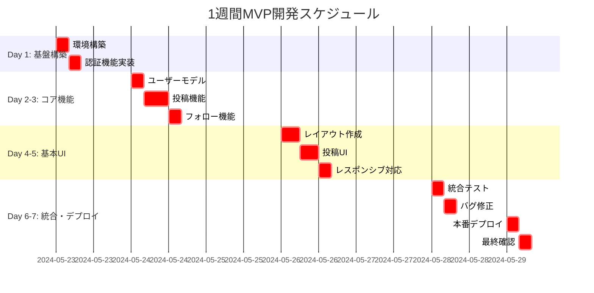
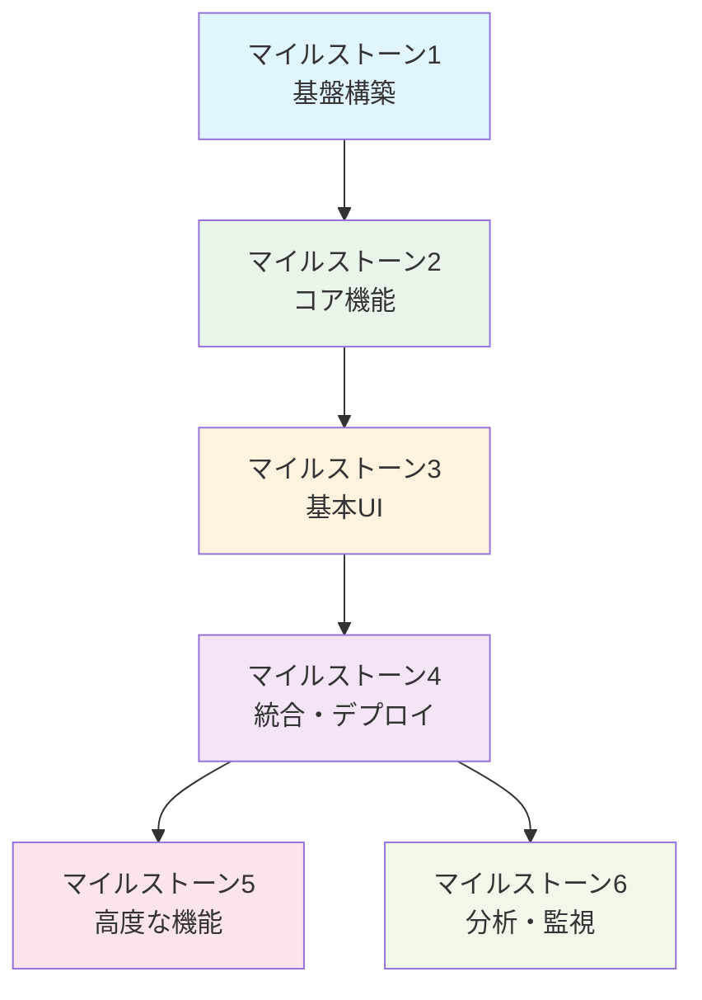

# マイルストーン管理

## 📋 1週間MVP開発マイルストーン

### マイルストーン1: MVP基盤構築（Day 1）
- **期間**: 2024-05-23（1日間）
- **目標**: 開発環境の整備と基本認証機能の実装
- **成果物**: 動作する開発環境、ユーザー認証機能
- **詳細**: [01_foundation.md](./01_foundation.md)

### マイルストーン2: MVPコア機能実装（Day 2-3）
- **期間**: 2024-05-24 ~ 2024-05-25（2日間）
- **目標**: SNSの基本機能（投稿・フォロー・いいね）の実装
- **成果物**: 投稿機能、フォロー機能、いいね機能
- **詳細**: [02_core_features.md](./02_core_features.md)

### マイルストーン3: MVP基本UI実装（Day 4-5）
- **期間**: 2024-05-26 ~ 2024-05-27（2日間）
- **目標**: 基本的なレスポンシブUIの実装
- **成果物**: レスポンシブレイアウト、基本的なインタラクション
- **詳細**: [04_ui_ux_enhancement.md](./04_ui_ux_enhancement.md)

### マイルストーン4: 統合テスト・デプロイ（Day 6-7）
- **期間**: 2024-05-28 ~ 2024-05-29（2日間）
- **目標**: 統合テスト実施と本番環境デプロイ
- **成果物**: 本番稼働するMVPアプリケーション
- **詳細**: [04_integration_and_deployment.md](./04_integration_and_deployment.md)

## 🔮 将来拡張マイルストーン

### マイルストーン5: 高度な機能（Phase 2）
- **期間**: MVP完了後の将来実装
- **目標**: リアルタイム通知、検索機能、セキュリティ強化
- **詳細**: [03_advanced_features.md](./03_advanced_features.md)

### マイルストーン6: 分析・モニタリング（Phase 3）
- **期間**: MVP完了後の長期実装
- **目標**: ユーザー行動分析、パフォーマンス監視、ビジネス指標
- **詳細**: [05_analytics_and_monitoring.md](./05_analytics_and_monitoring.md)

## 📊 進捗管理

### 1週間MVP開発の進捗

### 依存関係

## 🎯 成功指標

### MVP完成の定義
- ✅ ユーザーが新規登録・ログインできる
- ✅ ユーザーが投稿を作成・編集・削除できる
- ✅ ユーザーが他のユーザーをフォローできる
- ✅ ユーザーが投稿にいいねできる
- ✅ レスポンシブデザインで表示される
- ✅ 本番環境でアクセス可能

### 品質指標
- ページロード時間: 3秒以内
- APIレスポンス時間: 200ms以内
- 主要ブラウザでの動作確認済み
- モバイル・デスクトップ両対応

## 📝 マイルストーン管理ルール

### 1. 進捗更新
- 各マイルストーンの開始時にチェックボックスを更新
- 完了時に成果物と課題を記録
- 次のマイルストーンへの引き継ぎ事項を明記

### 2. 課題管理
- 各マイルストーンで発生した課題を記録
- 解決策と対応時間を記録
- 将来の参考となるよう詳細を残す

### 3. 品質管理
- 各マイルストーンでレビューポイントを確認
- 品質基準を満たさない場合は次に進まない
- 必要に応じてスケジュール調整を実施

## 🔄 フェーズ管理

### Phase 1: MVP開発（1週間）
- **目標**: 基本的なSNS機能の実現
- **範囲**: マイルストーン1-4
- **成果**: 本番稼働するMVPアプリケーション

### Phase 2: 機能拡張（1-2ヶ月）
- **目標**: 高度な機能の追加
- **範囲**: マイルストーン5
- **成果**: リアルタイム機能、検索機能等

### Phase 3: 本格運用（3-6ヶ月）
- **目標**: 分析・監視機能の充実
- **範囲**: マイルストーン6
- **成果**: データドリブンな運用体制

---

**最終更新**: 2025-05-23  
**ステータス**: MVP計画確定  
**次のアクション**: マイルストーン1実装開始